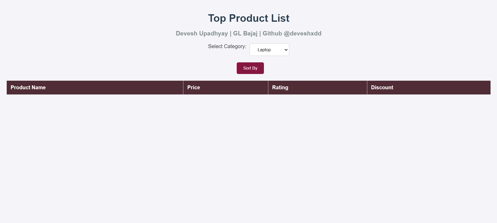
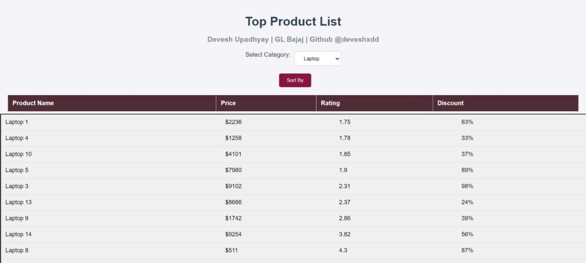

- NAME: Devesh Upadhyay
- Roll No: 2101920130057
- Email: it21151@glbitm.ac.in

- Images

- Users can retrieve the top 'n' products within a specific category by making a GET request to the "/categories/:categoryname/products" endpoint. 
- The number of products 'n' can be specified as a query parameter. If 'n' exceeds 10, pagination is enforced by including a "page" query parameter. 
- Each page contains a maximum of 'n' products.
- The microservice generates a custom unique identifier for each product in the response. 
- his identifier ensures that the product can be easily referenced and matched with the corresponding product details.
- Users can pass additional query parameters to sort the results based on rating, price, company, or discount in ascending or descending order. 
- This allows users to customize the order in which the products are displayed, based on their preferences.

